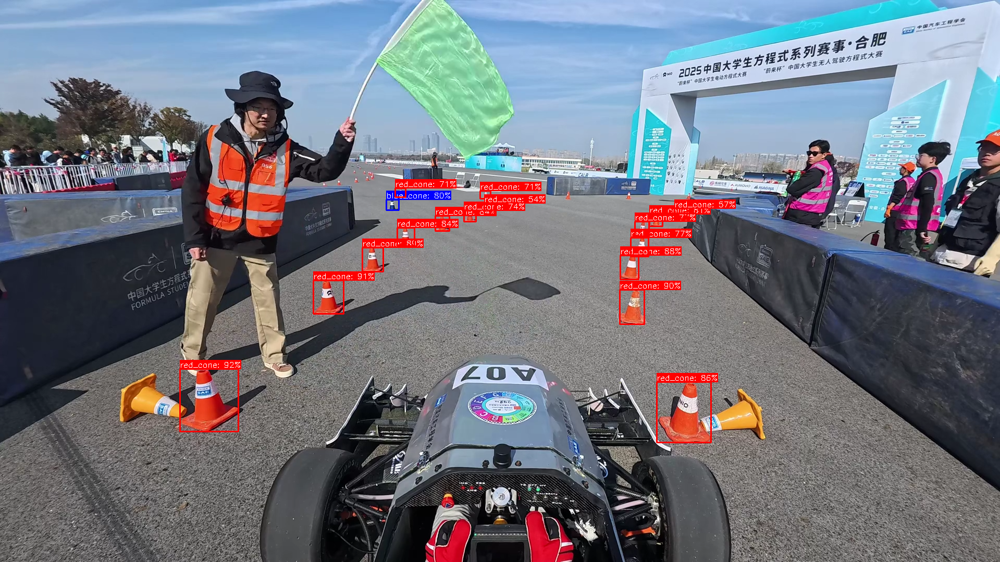

<h1 align="center">🏎 AS_Training-2025 入门作业 🚦</h1>


---

## 📋 目录
 - [作业任务](#作业任务)
 - [效果演示](#效果演示)
 - [参考资料](#参考资料)
 - [思考与拓展](#思考与拓展)

---

## 作业任务
### 任务一：虚拟相机推理与可视化
1. 使用 `virtual_cam` 节点作为虚拟相机，将视频流发布到指定话题（该节点需要自行补充）。
2. 创建算法处理节点，参考 `weight/onnx_infer.cpp` 中的 `YOLO11Detector` 类，对虚拟相机话题进行锥桶识别推理。
3. 要求使用零拷贝和组件节点，提升效率。
4. 设计高效实时的可视化方法，展示锥桶识别效果。

### 任务二：点云地面分割与锥桶聚类
1. 播放 rosbag 包，获取点云数据。
2. 使用地面分割算法和点云聚类算法，对锥桶进行聚类。
3. 推荐参考 Patchwork、LineFit、Efficient Online Segmentation 等开源实现。

数据集下载地址 [Google云盘](https://drive.google.com/drive/folders/1qJzg5pSOcMIFURpUw0nEF7shEaCXsGxP?usp=drive_link)

---

## 效果演示
### 虚拟相机推理效果
下图为虚拟相机节点结合YOLO11算法对锥桶进行识别的可视化效果：


### 地面分割与锥桶聚类效果
下图为地面分割与点云聚类后锥桶检测的动态演示：


---

## 参考资料
### ONNXRuntime 配置
1. 前往 [ONNXRuntime Releases](https://github.com/microsoft/onnxruntime/releases/) 下载已编译的文件。
2. 解压到指定目录，并设置环境变量：
	```shell
	export ONNXRUNTIME_DIR="/home/as/onnxruntime"
	export LD_LIBRARY_PATH=/home/as/onnxruntime/lib:$LD_LIBRARY_PATH
	```

### 地面分割与聚类算法参考
- [Patchwork (url-kaist)](https://github.com/url-kaist)
- [LineFit (gitee)](https://gitee.com/kin-zhang/linefit)
- [Efficient Online Segmentation](https://github.com/KennyWGH/efficient_online_segmentation)
- [DBSCAN](https://zhuanlan.zhihu.com/p/1925351611942809908)
- [EC](https://blog.csdn.net/lemonxiaoxiao/article/details/106061265)

---

## 思考与拓展

- 同一锥桶在多帧中只有部分帧被识别出，如何用其他算法（如 Kalman 滤波、匈牙利匹配等）提升目标追踪的鲁棒性？
- 为什么对锥桶进行聚类前需要先进行地面分割？
- 点云聚类容易出现误识别，如何在不影响精确率的情况下减少误识别？
